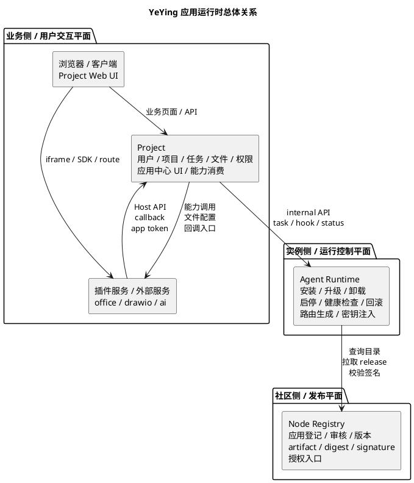
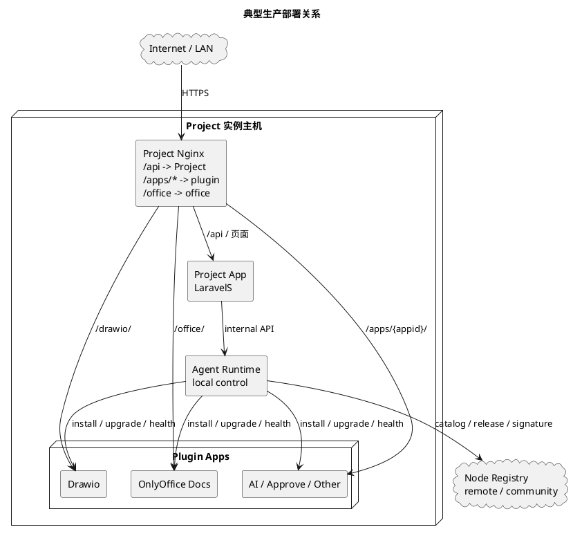
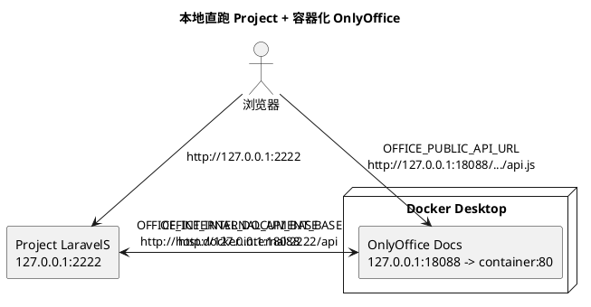
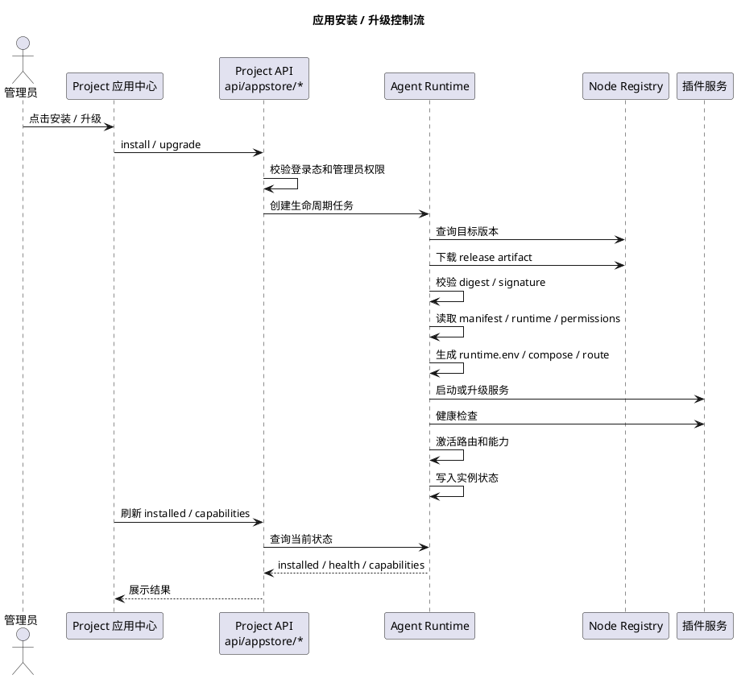
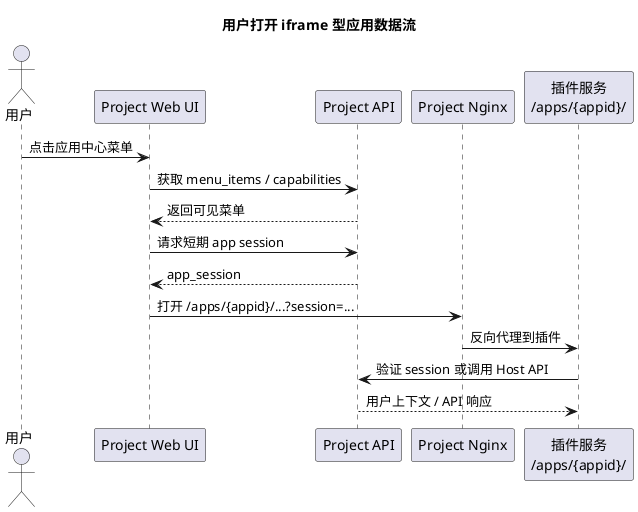
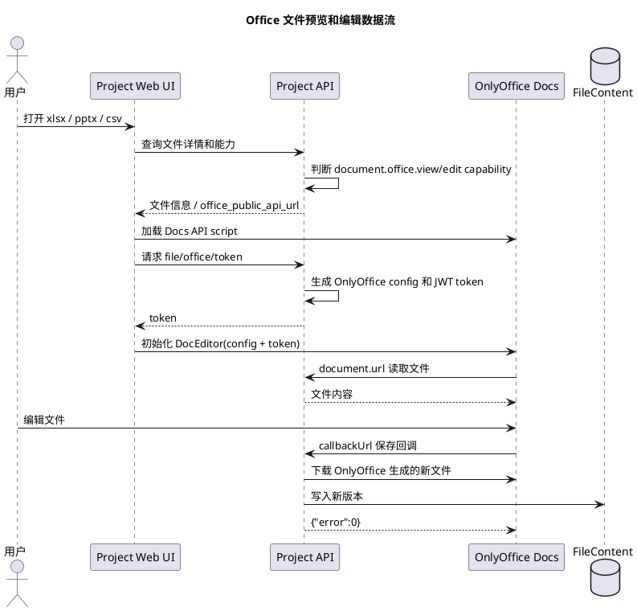
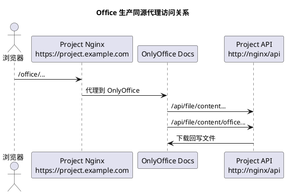
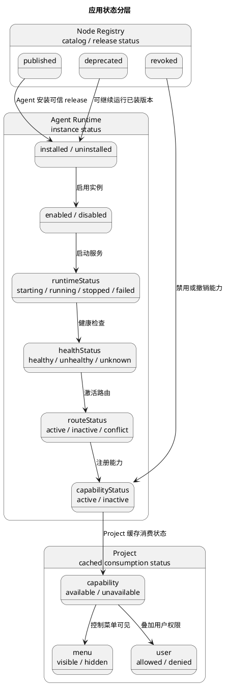
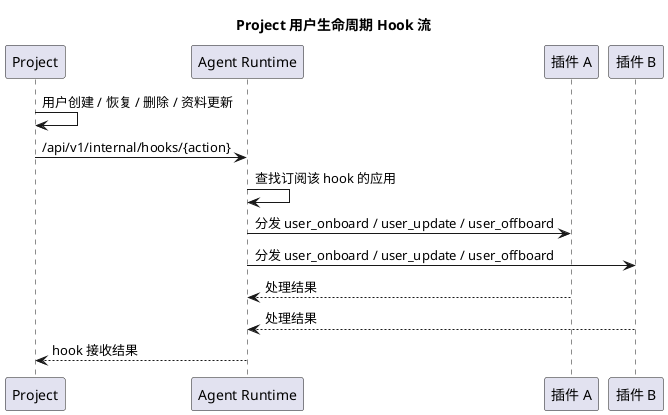

# 应用运行时协议与职责边界

本文用于沉淀 Project、Node、Agent Runtime 在应用中心、插件、智能体和外部能力服务上的职责边界。目标是让当前 OnlyOffice、Drawio、Minder、AI、Approve 等应用的安装和运行方式可以持续迭代，而不是继续依赖隐式目录约定和历史 AppStore 名称。

## 1. 当前结论

YeYing 应用中心应拆成三个平面：

```text
Node Registry       社区发布与授权平面
Agent Runtime       实例运行控制平面
Project             业务消费与用户交互平面
```

职责边界：

- **Node Registry** 管应用和智能体的登记、审核、版本、release artifact、签名、授权和社区目录，不直接操作客户或本地 Project 实例。
- **Agent Runtime** 管某个 Project 实例上的安装、升级、卸载、启停、健康检查、回滚、路由生成、密钥注入和运行状态，是插件与智能体的唯一运行控制面。
- **Project** 管项目、任务、文件、权限、用户上下文和前端入口，只消费 Agent Runtime 提供的应用清单、菜单、能力和运行状态。

Project 中的 `api/appstore/*` 继续作为历史兼容入口存在，但它不应再代表“Project 自己安装插件”，也不应直接指向 Node。新部署应让它代理 Agent Runtime。

## 2. 系统关系

应用中心不是一个单体服务，而是一组系统协作。核心关系如下：



这张图表达三条边界：

- **发布边界**：Node Registry 面向社区和发布者，回答“有哪些应用、哪些版本可信、artifact 在哪里、是否有安装授权”。
- **运行边界**：Agent Runtime 面向某个 Project 实例，回答“这个实例安装了什么、运行是否健康、路由是否激活、失败如何回滚”。
- **业务边界**：Project 面向用户和业务数据，回答“用户能看到哪些菜单、某个文件能否预览、某个插件能否调用 Project API”。

### 2.1 物理部署关系

典型生产部署：



本地开发可以更轻：



所以本地直跑 Project 不一定需要 nginx，但生产建议使用 Project Nginx 统一暴露 `/office/`、`/drawio/`、`/apps/*`。

### 2.2 控制流：安装和升级

安装或升级应用时，控制流应是：



控制流中，Project 不直接拉镜像、不解压 artifact、不执行 Docker Compose。Node 不直接进入客户机器执行安装。Agent Runtime 是唯一执行者。

### 2.3 数据流：用户打开应用

用户打开 iframe 型应用时，数据流应是：



当前旧实现中，部分插件 URL 仍带：

```text
user_id={user_id}
user_token={user_token}
theme={system_theme}
lang={system_lang}
```

这是兼容方式。目标协议中应改为短期 `app_session`，避免长期 Project token 暴露给 iframe。

### 2.4 数据流：Office 文件预览和编辑

OnlyOffice 这类能力型应用没有明显菜单，主要由文件模块消费：



本地直连配置对应：

```text
OFFICE_PUBLIC_API_URL              浏览器访问 OnlyOffice SDK
OFFICE_INTERNAL_API_BASE           OnlyOffice 容器访问 Project API
OFFICE_INTERNAL_DOCUMENT_BASE      Project 后端访问 OnlyOffice 生成文件
```

生产同源代理对应：



这说明 `office` 不只是一个 appId，更是 `document.office.view` 和 `document.office.edit` 能力 provider。

### 2.5 状态流：安装状态、运行状态和能力状态

状态不应只有一个 `installed`。推荐状态关系：



Project 业务代码应该优先看：

```text
capability available + user allowed
```

而不是只看：

```text
app installed
```

### 2.6 Hook 流：Project 事件通知插件

Project 发生用户生命周期事件时：



这条链路由 Agent Runtime 管分发，Project 不应逐个调用插件服务。这样新增插件不会要求 Project 改业务代码。

### 2.7 信任关系

各系统间的信任关系应分层：

| 方向 | 鉴权方式 | 说明 |
| --- | --- | --- |
| Project -> Agent Runtime | `AGENT_INTERNAL_TOKEN` | 本实例内部控制面鉴权 |
| Agent Runtime -> Node Registry | Node 授权令牌 / 实例身份 | 拉取目录、artifact、签名和授权 |
| Plugin -> Project Host API | app token / APP_SECRET / scope | 插件服务端访问 Project API |
| Browser -> Plugin iframe | app session | 用户打开应用时的短期身份 |
| OnlyOffice -> Project callback | OnlyOffice JWT + callback token | 文档读取和保存回调 |

长期目标是所有跨系统调用都带：

```text
issuer
audience
app_id
instance_id
scope
expires_at
signature
```

### 2.8 外部服务和内置插件的关系

外部服务不是协议之外的特殊情况。外部服务也应注册 capability：

```text
外部 OnlyOffice Docs -> document.office.view/edit
外部 PlantUML Server -> document.markdown.plantuml
外部 Manticore       -> search.fulltext
外部 AI Gateway      -> ai.assistant / ai.chat
```

区别只在 provider 管理方：

```text
内置插件 provider：Agent Runtime 安装、启停、升级、健康检查
外部服务 provider：管理员配置地址和密钥，Agent Runtime 或 Project 做健康检查和 capability 注册
```

Project 消费侧不应该区分 provider 来源，只关心 capability 是否可用。

### 2.9 一句话关系模型

```text
Node 发布可信能力，Agent 把可信能力安装并运行到某个实例，Project 在业务中消费这些能力。
```

## 3. 现状实现

### 3.1 Project 到 Agent Runtime

当前 Project 的应用市场接口在 `AppStoreController` 中实现：

```text
GET  /api/appstore/installed
POST /api/appstore/install
POST /api/appstore/upgrade
POST /api/appstore/uninstall
```

这些接口只做：

1. 校验用户登录态。
2. 安装、升级、卸载时校验管理员权限。
3. 透传当前语言、Project 用户 token、Project 实例 ID。
4. 使用 `AGENT_INTERNAL_TOKEN` 调用 Agent Runtime 的 internal API。
5. 把 Agent Runtime 响应包装成 Project 统一的 `ret/msg/data` 格式。

对应配置：

```dotenv
AGENT_INTERNAL_URL=http://127.0.0.1:3900
AGENT_INSTANCE_ID=project
AGENT_INTERNAL_TOKEN=
```

旧配置名仍保留，但只作为兼容入口：

```dotenv
APPSTORE_INTERNAL_URL=
APPSTORE_INSTANCE_ID=project
APPSTORE_AGENT_TOKEN=
```

新部署中，`APPSTORE_INTERNAL_URL` 如果仍被使用，也应指向 Agent Runtime，而不是 Node Registry。

### 3.2 本地插件包目录

Project 仓库里仍保留历史插件包目录：

```text
docker/appstore/apps/{appid}/
docker/appstore/apps/{appid}/{version}/
docker/appstore/config/{appid}/
docker/appstore/runtime/{appid}/
docker/appstore/releases/{appid}/{version}/{digest}/
```

典型插件包：

```text
docker/appstore/apps/office/9.4.0/docker-compose.yml
docker/appstore/apps/office/9.4.0/nginx.conf
docker/appstore/apps/drawio/30.0.4/docker-compose.yml
docker/appstore/apps/drawio/30.0.4/nginx.conf
```

当前安装状态判断依赖：

```text
docker/appstore/config/{appid}/config.yml
```

只有该文件存在，且内容包含：

```yaml
status: installed
```

Project 才认为插件已安装。这个判断只表示“安装状态”，不等于服务真实健康，也不等于路由已经可访问。

### 3.3 应用包当前结构

当前应用包主要由几个文件组成：

```text
config.yml          应用元数据、字段、菜单、版本要求、hook
docker-compose.yml 运行服务声明
nginx.conf          Project nginx 反向代理片段
openapi.yaml        可选，给 AI 或命令调用使用
README.md           应用说明
logo.svg            应用图标
```

例如 OnlyOffice：

```yaml
name: OnlyOffice
description:
  zh: 一个功能完整的办公套件。
categories:
  - collaboration
  - document
hooks:
  install: |
    chmod 644 -R ./*
```

版本目录中声明服务：

```yaml
services:
  office:
    image: "onlyoffice/documentserver:9.4.0.1"
    environment:
      JWT_SECRET: ${APP_KEY}
```

并通过 nginx 暴露：

```nginx
location /office/ {
    proxy_pass http://office/;
}
```

例如 Drawio：

```yaml
services:
  drawio-webapp:
    image: "jgraph/drawio:30.0.4"

  drawio-export:
    image: "dootask/export-server:latest"
```

并通过路径暴露：

```text
/drawio/webapp/
/drawio/export/
```

### 3.4 前端菜单

Project 前端通过：

```text
api/appstore/installed
```

获取已安装应用列表，并写入 Vuex：

```text
microApps
microAppsInstalled
microAppsIds
microAppsMenus
```

前端菜单消费应用返回的 `menu_items`。插件可以声明：

```yaml
menu_items:
  - location: application
    label:
      zh: 审批中心
      en: Approval
    url: "apps/approve/?theme={system_theme}&lang={system_lang}&user_id={user_id}&user_token={user_token}"
    url_type: iframe
    immersive: true
```

Project 还支持自定义微应用菜单，数据保存在 `microapp_menu` 系统设置中。这类菜单不一定有容器运行时，只是 Project 前端里的外部 iframe 入口。

### 3.5 插件与 Project 通信

当前通信方式包括：

- iframe URL 参数：`user_id`、`user_token`、`theme`、`lang`。
- Project nginx 代理：`/office/`、`/drawio/webapp/`、`/apps/approve/`。
- 插件服务端调用 Project API：例如 `api/apps/badge/set` 使用 `appid + secret`。
- Project 调 Agent Runtime hook：例如 `user_onboard`、`user_offboard`、`user_update`。
- 插件声明 `openapi.yaml`：用于 AI app-command 或 MCP 类能力调用。

这些能力已经能支撑现有插件，但协议边界还不够清晰。

## 4. 当前问题

### 4.1 安装状态和能力可用状态混在一起

当前很多业务逻辑问的是：

```text
应用 office 是否已安装？
```

但真正需要回答的是：

```text
当前实例是否具备 Office 文档预览能力？
当前实例是否具备 Office 文档编辑能力？
当前实例是否具备 Drawio 编辑能力？
```

OnlyOffice 本地验证暴露了这个问题：只要外部 OnlyOffice Docs 服务已配置且可访问，即使没有 `docker/appstore/config/office/config.yml`，Project 也应该可以使用 Office 文档能力。

### 4.2 nginx.conf 是裸配置片段

插件包直接提供 nginx 片段，灵活但难管控。风险包括：

- 插件可能覆盖保留路径。
- 路径冲突不容易在安装前发现。
- WebSocket、超时、上传大小、Header 规则不统一。
- 安全策略依赖插件作者自觉。

### 4.3 运行状态源分散

Project 现在既能通过 Agent Runtime 查安装列表，也会直接读本地 `docker/appstore/config/{appid}/config.yml` 判断部分能力。长期看，Project 不应该同时依赖两个状态源。

### 4.4 用户身份透传方式需要升级

当前 iframe URL 直接带 `user_token`。这能兼容旧插件，但不是理想协议。后续应转为短期 app session token，包含 appId、userId、DID、scope、过期时间，并按插件声明的权限最小化授权。

## 5. 目标协议

目标协议建议命名为：

```text
YeYing App Runtime Protocol
```

它不是单纯“应用商店协议”，而是覆盖应用包、运行实例、路由、能力、鉴权、生命周期和状态回传的一组协议。

核心原则：

1. Project 不直接管理容器，只消费 Agent Runtime 的声明和状态。
2. Agent Runtime 是安装、升级、卸载、启停、健康检查和回滚的唯一执行者。
3. Node Registry 只做发布目录、版本、签名、授权和 artifact 分发。
4. 插件包声明 routes、capabilities、config、secrets，不提交任意 nginx 逻辑作为源协议。
5. Project 业务代码依赖 capability，不依赖 appId。
6. 用户身份使用短期 app session，不长期透传 Project user_token。
7. 安装状态、启用状态、健康状态、能力状态分开。
8. 外部服务和内置插件都能注册同一种 capability。

## 6. Node Registry 职责

Node 是社区应用和智能体发布中心，应管理：

- 应用登记：appId、名称、作者、分类、描述、图标、仓库、文档。
- 版本管理：版本号、兼容主程序版本、变更日志、发布时间。
- release artifact：应用包内容、下载地址、digest。
- 签名与可信发布：签名、公钥、发布者身份、审核状态。
- 授权入口：私有应用、商业授权、实例授权、可安装范围。
- 协议 schema：manifest 版本、runtime schema、权限声明 schema。
- 社区目录：应用中心可浏览的公开应用和智能体列表。

Node 不应管理：

- 不直接启动客户机器上的容器。
- 不写 Project 的 `docker/appstore/` 状态目录。
- 不保存某台 Project 机器的运行时临时状态。
- 不决定某次安装任务的本地回滚细节。

Agent 需要安装或升级时，从 Node 拉取：

```text
manifest
release artifact
digest
signature
config schema
permissions
dependencies
capabilities
```

## 7. Agent Runtime 职责

Agent Runtime 是每个 Project 实例旁边的运行控制面，应管理：

- 安装任务：下载 artifact、校验签名、解析 manifest、准备配置、启动服务。
- 升级任务：拉取新版本、执行迁移、健康检查、失败回滚。
- 卸载任务：停止服务、移除路由、保留或清理数据。
- 启停任务：enable、disable、restart。
- 健康检查：服务端口、HTTP healthcheck、依赖连通性、路由可达性。
- 路由生成：从 manifest 的 route 声明生成受控 nginx 配置。
- 密钥管理：生成 APP_SECRET，注入 Project APP_KEY 派生密钥，支持轮换。
- 状态落盘：维护 instance state、runtime state、release state。
- hook 分发：接收 Project 用户生命周期 hook，再分发给相关应用。
- 能力汇总：向 Project 返回当前实例已启用且健康的 capabilities。

Agent Runtime 对 Project 暴露 internal API：

```text
GET  /api/v1/internal/installed
GET  /api/v1/internal/apps/{appId}
GET  /api/v1/internal/apps/{appId}/health
GET  /api/v1/internal/apps/{appId}/logs
POST /api/v1/internal/apps/{appId}/install
POST /api/v1/internal/apps/{appId}/upgrade
POST /api/v1/internal/apps/{appId}/enable
POST /api/v1/internal/apps/{appId}/disable
POST /api/v1/internal/apps/{appId}/restart
POST /api/v1/internal/apps/{appId}/uninstall
GET  /api/v1/internal/tasks/{taskId}
POST /api/v1/internal/hooks/{action}
```

鉴权：

```http
Authorization: Bearer <AGENT_INTERNAL_TOKEN>
X-YeYing-Instance: project
```

Project 调用 Agent Runtime 时不传数据库密码、S3 密钥等敏感配置。Agent 只从本机 Project `.env` 或受控密钥文件读取需要注入给插件的值，并按 manifest 限定白名单。

## 8. Project 职责

Project 是业务系统，应管理：

- 用户、部门、项目、任务、文件、消息、权限。
- 应用中心前端入口。
- `api/appstore/*` 历史兼容接口。
- 文件模块对文档能力的消费。
- 微应用菜单渲染。
- 用户上下文、语言、主题、DID 和最小 scope 授权。
- 插件回调 API 的权限校验和审计。

Project 不应管理：

- 不在 Web 请求里拉镜像。
- 不在 Web 请求里执行 Docker Compose。
- 不直接访问 Node 创建安装任务。
- 不把 `docker/appstore/config/{appid}/config.yml` 作为长期唯一真状态源。

Project 业务代码应逐步从：

```php
Apps::isInstalled('office')
```

迁移到：

```php
Apps::requireCapability('document.office.view', [
    'extension' => 'xlsx',
]);
```

也就是说，Project 只问“能力是否存在”，不问“哪个 app 提供了能力”。OnlyOffice、外部 Office 服务或未来替代服务都可以注册同一种 capability。

## 9. 应用包 Manifest

目标 manifest 示例：

```yaml
apiVersion: yeying.app/v1
kind: Application
metadata:
  id: office
  name:
    zh: OnlyOffice
    en: OnlyOffice
  version: 9.4.0
  vendor: yeying-community
  description:
    zh: Office 文档预览和编辑
    en: Office document preview and editing
  categories:
    - document
    - collaboration
  tags:
    - 在线文档

runtime:
  type: compose
  compose: compose.yaml
  environment:
    - name: ONLYOFFICE_JWT_SECRET
      from: project.APP_KEY
      required: true

routes:
  - id: office
    publicPath: /office/
    upstream: http://office/
    stripPrefix: true
    websocket: true
    timeoutSeconds: 3600
    maxBodySize: 1024m

capabilities:
  - id: document.office.view
    formats: [doc, docx, xls, xlsx, xlsm, ods, csv, tsv, ppt, pptx]
  - id: document.office.edit
    formats: [docx, xlsx, pptx, csv, tsv]

menus: []

permissions:
  hostApis:
    - file.read
    - file.write
    - user.basic.read

secrets:
  - name: APP_SECRET
    generate: random

healthchecks:
  - type: http
    url: http://office/healthcheck
    successCodes: [200]
```

字段含义：

- `metadata`：Node Registry 展示、搜索、审核和版本管理使用。
- `runtime`：Agent Runtime 安装、配置和启动服务使用。
- `routes`：Agent Runtime 生成受控反向代理配置使用。
- `capabilities`：Project 业务模块判断能力使用。
- `menus`：Project 前端应用中心渲染入口使用。
- `permissions`：Project 生成短期 app session 和限制 Host API 使用。
- `secrets`：Agent Runtime 生成或注入密钥，不由插件包写死。
- `healthchecks`：Agent Runtime 判定服务健康和升级回滚使用。

## 10. 实例状态协议

每个 Project 实例上，Agent Runtime 应维护实例状态：

```yaml
apiVersion: yeying.app.instance/v1
appId: office
version: 9.4.0
status: installed
desiredStatus: running
runtimeStatus: running
healthStatus: healthy
installedAt: 2026-08-31T10:00:00+08:00
updatedAt: 2026-08-31T10:00:00+08:00
release:
  digest: sha256:...
  dir: docker/appstore/releases/office/9.4.0/sha256...
routes:
  - publicPath: /office/
    active: true
capabilities:
  - id: document.office.view
    status: active
  - id: document.office.edit
    status: active
secrets:
  appSecretRef: local://docker/appstore/config/office/secrets.env
```

状态要分开：

```text
installed      是否已安装到实例
enabled        是否允许对 Project 暴露入口和能力
runtimeStatus  容器或进程是否正在运行
healthStatus   健康检查是否通过
capabilities   当前可被 Project 消费的能力
```

Project 判断能力时应优先使用 `capabilities.status=active`，而不是只看 `installed`。

## 11. 路由协议

插件包不应长期提供裸 `nginx.conf` 作为源协议。应改成声明式路由：

```yaml
routes:
  - publicPath: /apps/approve/
    upstream: http://approve:3000
    stripPrefix: false
    websocket: true
    timeoutSeconds: 300

  - publicPath: /office/
    upstream: http://office/
    stripPrefix: true
    websocket: true
    timeoutSeconds: 3600
    maxBodySize: 1024m
```

Agent Runtime 负责生成 nginx 配置，并统一加：

```text
Host
X-Real-IP
X-Forwarded-For
X-Forwarded-Proto
Upgrade
Connection
proxy_read_timeout
proxy_send_timeout
client_max_body_size
```

安装前必须校验：

- 不允许覆盖 `/`。
- 不允许覆盖 `/api/`。
- 不允许覆盖 `/login`、`/ws` 等保留路径。
- 不允许两个应用声明同一个 `publicPath`。
- `publicPath` 必须以 `/apps/{appid}/` 或协议允许的系统路径开头。
- 系统路径如 `/office/`、`/drawio/` 必须由受控能力白名单允许。

## 12. 能力协议

能力协议是后续持续迭代的核心。业务代码不应该依赖 appId，而应该依赖 capability。

示例能力：

```text
document.office.view
document.office.edit
document.diagram.edit
document.mind.edit
document.file.preview
search.fulltext
search.vector
ai.assistant
approval.workflow
checkin.face
```

Project 文件模块示例：

```text
xlsx/csv/pptx -> document.office.view
drawio        -> document.diagram.edit
km/mind       -> document.mind.edit
pdf/ofd/cad   -> document.file.preview
```

能力查询可以支持上下文：

```json
{
  "capability": "document.office.view",
  "context": {
    "extension": "xlsx",
    "mode": "view"
  }
}
```

Agent Runtime 返回：

```json
{
  "available": true,
  "provider": "office",
  "version": "9.4.0",
  "health": "healthy"
}
```

这样外部 OnlyOffice 服务、应用市场安装的 OnlyOffice 插件、未来其他 Office 服务，都可以提供 `document.office.view`。

## 13. 鉴权协议

应逐步从 URL 里透传长期 `user_token`，迁移为短期 app session。

当前方式：

```text
/apps/approve/?user_id={user_id}&user_token={user_token}
```

目标方式：

```text
/apps/approve/?session={short_lived_app_session}
```

session 内容：

```json
{
  "iss": "project",
  "aud": "approve",
  "sub": "did:yeying:...",
  "project_user_id": 10001,
  "app_id": "approve",
  "scopes": [
    "identity.basic",
    "identity.username",
    "project.user.read"
  ],
  "exp": 178...
}
```

服务端插件调用 Project API 时使用 app token：

```http
Authorization: Bearer <app_token>
X-YeYing-App-Id: approve
X-YeYing-Instance: project
```

敏感回调增加签名：

```http
X-YeYing-Timestamp: 178...
X-YeYing-Nonce: ...
X-YeYing-Signature: ...
```

Project 需要校验：

- appId 已安装或 capability 已注册。
- token 未过期。
- scope 覆盖目标 API。
- nonce 未重复。
- 回调来源和签名可信。

## 14. OnlyOffice 示例

OnlyOffice 不是典型“菜单应用”，更像系统文档能力提供者。

它应注册：

```yaml
capabilities:
  - id: document.office.view
    formats: [doc, docx, xls, xlsx, xlsm, ods, csv, tsv, ppt, pptx]
  - id: document.office.edit
    formats: [docx, xlsx, pptx, csv, tsv]
```

它应声明：

```yaml
routes:
  - publicPath: /office/
    upstream: http://office/
```

它需要配置：

```dotenv
OFFICE_PUBLIC_API_URL=
OFFICE_INTERNAL_API_BASE=http://nginx/api
OFFICE_INTERNAL_DOCUMENT_BASE=http://nginx
```

本地直跑 Project、容器化 OnlyOffice 时可以配置：

```dotenv
OFFICE_ENABLED=true
OFFICE_PUBLIC_API_URL=http://127.0.0.1:18088/web-apps/apps/api/documents/api.js
OFFICE_INTERNAL_API_BASE=http://host.docker.internal:2222/api
OFFICE_INTERNAL_DOCUMENT_BASE=http://127.0.0.1:18088
```

这说明协议必须支持两种 provider：

```text
内置插件 provider：由 Agent Runtime 安装和管理
外部服务 provider：由管理员手动配置，Project/Agent 注册能力
```

长期看，`OFFICE_ENABLED=true` 应落入 capability registry，而不是散落在文件模块里做特殊判断。

## 15. Drawio 示例

Drawio 是文件编辑能力 provider，应注册：

```yaml
capabilities:
  - id: document.diagram.edit
    formats: [drawio]
  - id: document.diagram.export
    formats: [png, svg, pdf]
```

它应声明：

```yaml
routes:
  - publicPath: /drawio/webapp/
    upstream: http://drawio-webapp:8080/
  - publicPath: /drawio/export/
    upstream: http://drawio-export:8000/
```

Project 文件模块打开 `.drawio` 时，应判断 `document.diagram.edit`，而不是判断 `drawio` 插件目录是否安装。

## 16. AI 与 MCP 示例

AI 助手和 MCP 类插件应注册能力，而不是只作为菜单：

```yaml
capabilities:
  - id: ai.assistant
  - id: ai.app-command
  - id: mcp.tools
```

插件可以附带：

```text
openapi.yaml
tool-manifest.json
knowledge_base
```

Project 应把这些能力暴露给 AI 助手，而不是让 AI 助手硬编码某个插件 id。Node 负责发布和审核这些能力声明，Agent Runtime 负责在本实例安装并汇总可用能力。

## 17. 生命周期任务

生命周期任务必须是异步任务，不应在 Project Web 请求中完成。

安装任务状态：

```text
pending
claimed
resolving
downloading
verifying
configuring
starting
checking
activating
succeeded
failed
rolling_back
rolled_back
rollback_failed
```

Project 前端只展示任务状态和日志摘要。Agent Runtime 负责实际执行。

失败回滚要求：

- 安装失败：清理未激活路由和临时 release，不影响旧应用。
- 升级失败：回滚到上一版本 release 和路由。
- 卸载失败：保留旧状态，标记 failed。
- 回滚失败：进入人工介入状态，不继续自动重试破坏现场。

## 18. 持续迭代路线

### 18.1 阶段 1：文档化和 schema 化

目标：不大改运行逻辑，先把现状变成可校验协议。

要做：

- 新增 `docs/架构/应用运行时职责边界.md`。
- 新增 manifest schema：`docs/app-manifest.schema.json`。
- 新增 instance schema：`docs/app-instance.schema.json`。
- 给现有 `docker/appstore/apps/*/config.yml` 补齐能力字段。
- 增加校验命令，检查应用包字段、路由、能力和版本约束。

### 18.2 阶段 2：引入 capability registry

目标：Project 业务代码从 appId 判断迁移到能力判断。

要做：

- 新增 `Apps::capabilities()`。
- 新增 `Apps::hasCapability($capability, $context = [])`。
- 新增 `Apps::requireCapability($capability, $context = [])`。
- 文件模块改为按扩展名判断文档能力。
- OnlyOffice 外部服务配置注册为 `document.office.view/edit` provider。

### 18.3 阶段 3：Agent Runtime 成为唯一运行状态源

目标：Project 不再直接把本地 `docker/appstore/config/{appid}/config.yml` 当作最终状态。

要做：

- Agent Runtime 的 `installed` 返回增加 `routes`、`capabilities`、`health`、`runtimeStatus`。
- Project 缓存 Agent 返回的实例能力。
- Project 后端能力判断优先读 Agent Runtime 状态。
- 本地 `docker/appstore/config` 只作为兼容缓存或 Agent 落盘实现细节。

### 18.4 阶段 4：路由生成协议替换裸 nginx.conf

目标：插件只声明路由，Agent Runtime 生成受控 nginx 配置。

要做：

- manifest 增加 `routes` schema。
- Agent Runtime 安装前校验路径冲突和保留路径。
- Agent Runtime 生成 `docker/appstore/config/{appid}/nginx.conf`。
- 历史插件包的 `nginx.conf` 作为兼容输入，逐步迁移。

### 18.5 阶段 5：短期 app session 替换长期 user_token

目标：插件打开和 Host API 调用有最小权限、短有效期、可审计。

要做：

- manifest 增加 `permissions` 和 `identity.requiredScopes`。
- Project 生成短期 app session。
- 插件后端通过 app token 调 Project API。
- Project 对插件 API 调用做 scope 校验和审计。
- URL 中不再暴露长期 Project `user_token`。

## 19. 推荐管理归属

推荐归属如下：

| 对象 | 管理方 | 原因 |
| --- | --- | --- |
| 应用目录、版本、审核、artifact、签名 | Node Registry | 属于社区发布和信任体系 |
| 安装任务、升级任务、容器、健康检查、回滚 | Agent Runtime | 属于某个实例的本地运行控制 |
| nginx 生成配置、端口、数据卷、密钥注入 | Agent Runtime | 需要接触本机运行环境 |
| 项目、任务、文件、权限、用户上下文 | Project | 属于业务系统 |
| 应用中心 UI、菜单入口、能力消费 | Project | 用户在 Project 内使用这些能力 |
| 智能体能力声明、MCP 工具 schema | Node Registry 发布，Agent Runtime 安装，Project 消费 | 三方协作 |
| 外部服务 provider，如手动部署 OnlyOffice | Agent Runtime 或 Project 配置注册 | 不一定来自应用市场，但应注册同一种 capability |

一句话：

```text
Node 管“能安装什么”，Agent 管“这个实例装了什么且运行得怎样”，Project 管“用户在业务里怎么使用这些能力”。
```

## 20. 当前代码的短期落点

短期内不应强行删除 `docker/appstore/` 历史目录，因为：

- 现有插件包仍放在这里。
- Project 已通过该目录读取安装状态和菜单。
- nginx 包含路径仍是 `docker/appstore/config/*/nginx.conf`。
- 迁移需要 Agent Runtime 和 Node Registry 同步完成。

短期可接受策略：

- 保留 `api/appstore/*` 兼容入口。
- 保留 `docker/appstore/apps` 作为内置插件包缓存。
- 保留 `docker/appstore/config` 作为兼容安装状态。
- 新增 capability 层，先解决业务判断依赖 appId 的问题。
- Agent Runtime 返回能力后，Project 逐步转向消费 Agent Runtime 状态。

## 21. 需要避免的方向

- 不要让 Project Web 请求直接执行 Docker 或 shell 安装。
- 不要让 Node 直接操作客户实例的容器或本地文件。
- 不要让插件长期提交任意 nginx 配置作为唯一入口。
- 不要让业务模块继续硬编码具体插件 id。
- 不要继续把长期 `user_token` 暴露给 iframe 插件。
- 不要把外部服务能力排除在应用协议之外。

## 22. 下一步建议

下一步建议按这个顺序推进：

1. 固化本文档作为当前讨论基线。
2. 给现有应用包补 `capabilities` 字段，先覆盖 `office`、`drawio`、`minder`、`fileview`、`search`、`ai`、`approve`。
3. 在 Project 增加 capability 查询模块，先从本地 manifest 和外部服务配置读取。
4. 文件模块改为消费 capability。
5. Agent Runtime 的 `installed` API 返回 capability、route、health。
6. Node Registry 的 release artifact 中强制包含 manifest、runtime、permissions、checksums、signature。
7. 逐步把插件鉴权从 URL `user_token` 迁到短期 app session。
